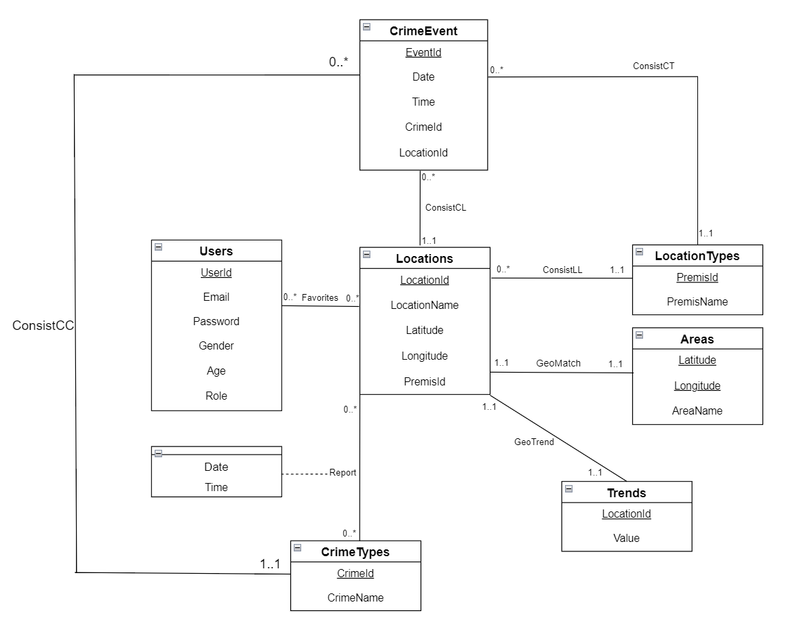

# Stage.2: Database Design

## UML Diagram



## Entities

There are a total of 7 entities in our database design. It is explained in detail as follows:

### 1. Users

This entity stores user information, with 6 attributes.

- **UserId**: a unique identifier between users. UserId will be the **primary key** and will be of a string attribute.
- **Email**: a string attribute, will be the username at the login page.
- **Password**: a string attribute, will be the password at the login page.
- **Gender**: an enumerate attribute with values `male`, `female`, `other`, and `unknown`.
- **Age**: an integer to show a user's age.
- **Role**: an enumerate attribute with values `user` and `reviewer`.

The entity is designed with the following assumptions:

1. Every user will have an auto-generated UserId that cannot be modified, regardless of user type(user or reviewer). It will be an internal identifier and will not be displayed publicly.
2. Every user will have an associated email, password, ,gender and age,  they can change both information freely. *Sex* is set to *unknown* by default, *Age* is set to *-1* by default.
3. Users cannot change their *Role*. Every user registered through the webpage are assigned to the role of *user*. Accounts with role *reviewer* are created manually and do not open for registration.
4. Users with different roles have different UI Interfaces.

> The reason why we add the attribute **UserId** while attribute **Email** is already unique is that we want to allow user to change their email address. We'll use UserId in all entities so that users can change their email address freely.
> 

### 2. CrimeEvents

This entity stores all crime events and the related information, with 5 attributes.

- **EventId:** a unique identifier of a crime event. This is the **primary key** and will be of an integer attribute.
- **Date**: a date attribute, representing the date of the crime.
- **Time**: ****a time attribute, representing the specific time of the crime.
- **CrimeId**: an integer attribute, **foreign key** to `CrimeTypes`.
- **LocationId**: an integer attribute, **foreign key** to `Locations`.
- **PremisId**: an integer attribute, **foreign key** to `LocationType`.

The entity is designed with the following assumptions:

1. We will only record the date, time, location, and type of offense in this entity set. But these elements are the most important identifying information for a crime event.
2. We can tell exactly when a crime occurred, down to the minute, thus we'll use that data to make more precise suggestions.
3. There is a general rule that the larger the EventId, the further back in time this crime event is. That means this is a chronological Id.

### 3. CrimeTypes

This entity stores the crime code and the corresponding crime name, with 2 attributes.

- **CrimeId**: a unique identifier of a crime. This is the **primary key** and will be of an integer attribute.
- **CrimeName:** a string attribute representing the name of a specific crime.

There are different crime types for different crimes. Different crime types also have different levels of danger. For example `THEFT PLAIN` does not pose much of a threat while `ASSAULT WITH DEADLY WEAPON` poses a serious threat.

### 4. Locations

This entity stores all the locations of the area, with 6 attributes.

- **LocationId**: a unique identifier of the location. This is the **primary key** and will be of a integer attribute.
- **LocationName**: a string sttribute to identify the name of location.
- **Latitude**: a floating-point attribute representing the latitude of location.
- **Longitude**: a floating-point attribute representing the longitude of location.
- **PremisId:** an integer attribute, **foreign key** to `LocationType`.

The entity is designed with the following assumptions:

1. The same location has the same longitude and latitude, we won't refine its precision and latitude for the same location again. Both are just used to better determine where the location is on the map.
2. For a location type we need to use the key of  `LocationTypes` as a foreign key for identification. One location can only correspond to one Locationtype.

### 5. Areas

This entity stores all information about different areas, including the area code and area name, with 2 attributes.

- **Latitude**: a floating-point attribute representing the latitude of location.
- **Longitude**: a floating-point attribute representing the longitude of location.
    
    Latitude and Longitude together serves as a **primary key**.
    
- **AreaName**: a string attribute to identify the name of the area. Such as `Southwest` or `Central`.

> Because a geographic location can cover a large area, when the need to pass through a geographic location is unavoidable, delineating specific `Areas` can help avoid crime-prone locations and can improve security.
> 

### 6. LocationTypes

This entity stores all the types of locations, with 2 attributes.

- **PremisId**: a unique identifier of the location types. It will be the **primary key** and will be of an integer attribute.
- **PremisName**: a string of the name of the location type. Such as `HOTEL` or  `BUS STOP`.

> Each location has its own function and relates to Users' travel options. For example, when going to  a bus stop to take a bus, we would recommend users more to take a bus stop where crime is not frequent.
> 

### 7. Trends

This entity stores crime trends in different locations. with 2 attributes.

- **LocationId**: ****an integer value to uniquely identify different locations. It will be the **primary key**.
- **Value**: a float-point value to indicate crime trends at this location. Larger values indicate greater danger.

Here `Trends` is the new entity that we will obtain by applying mathematical models and algorithms to the data after some post-processing procedures. Since there will be users adding or deleting data in the original table, we have to set up this table as a dynamic database, which will update regularly when `CrimeEvents` changes.

## Relations

There are a total of 8 relations in our database design. It is explained in detail as follows:

### 1. Favorites (Users and Locations)

`Favorites` is a relation between `Users` and  `Locations` to store all user's favorite locations. It has no additional attributes other than the primary keys of the two entities as foreign constraints.

This is a **many-to-many** location as a user can like many different locations and a location can be liked by many different users.

However, we have the restrictions based on the following assumptions:

1. Only user with `Role` of `user` can add favorite locations. 
2. If a user likes a location that does not exist in `Locations` , a new location will be created in `Locations` , with certain attributes(like `PremisId` ) in the default value.

### 2. Report (Locations and CrimeTypes)

`Report` is a relation between `Locations` and `CrimeTypes` to store all user reports of new crimes, with 2 attributes.

- **Date**: a date attribute, representing the date of the crime.
- **Time**: a time attribute, representing the specific time of the crime.

This relation will be a **many-to-many** relation as a specific crime can happen a multiple locations and a specific location can have multiple types of crime.

> User with `Role` of `reviewer` will review the above information in a separate UI. Whether the reviewer approves the report or not, the report will be deleted after review. If the report is approved, a new record in `CrimeEvents` will be created.
> 

### 3. ConsistLL (Locations and LocationTypes)

This is a relation between different location types for given locations. This is a **many-to-one** relation as each location can only have one location type but each location type can be at multiple locations. The `ConsistLL` relation has no attributes. And since this is a many-to-one relation, we will not create a separate table for it. We will simply add `PremisId`, the primary key of `LocationTypes`, to `Locations` and add foreign key constraints.

### 4. ConsistCL (CrimeEvents and Locations)

This is a relation between different crime events for given locations. This is a **many-to-one** relation as each crime event can only happen at one location but each location can have multiple crime events. The `ConsistCL` relation has no attributes. And since this is a many-to-one relation, we will not create a separate table for it. We will simply add `LocationId`, the primary key of `Locations`, to `CrimeEvents` and add foreign key constraints.

### 5. ConsistCC (CrimeEvents and CrimeTypes)

This is a relation between different crime events for given crime types. This is a **many-to-one** relation as each crime event can only have one crime type but each crime type can have multiple events. The `ConsistCC` relation has no attributes. And since this is a many-to-one relation, we will not create a separate table for it. We will simply add `CrimeId`, the primary key of `CrimeTypes`, to `CrimeEvents` and add foreign key constraints.

### 6. ConsistCT (CrimeEvents and LocationTypes)

This is a relation between different crime events for given locations. This is a **many-to-one** relation as each crime event can only happen at one location but each location can have multiple crime events. The `ConsistCT` relation has no attributes. And since this is a many-to-one relation, we will not create a separate table for it. We will simply add `PremisId`, the primary key of `LocationTypes`, to `CrimeEvents` and add foreign key constraints.

### 7. GeoMatch (Locations and Areas)

This is a relation between `Locations` and `Areas`. This is a **one-to-one** relation as each location will have one area and each area(with its latitude and longitude) will have its corresponding location. It has no additional attributes.

### 8. GeoTrend (Locations and Trends)

This is a relation between `Trends` and `Locations`. This is a **one-to-one** relation as each location will have one trend and each trend will have a corresponding location. It has no additional attributes.

## **Relational Schema**

The database design will be based on the following 9 normalized tables. A relation R is in 3rd Normalization Form (3NF): if whenever there is a nontrivial dependency A1, A2, ..., An -> B for R, then {A1, A2, ..., An } is a super-key for R, or B is part of a key. This holds for our tables.

### 1. Users

```scheme
Users(
	UserId VARCHAR(255) [PK], 
	Email VARCHAR(255), 
	Password VARCHAR(255), 
	Gender VARCHAR(255), 
	Age INT, 
	Role VARCHAR(255)
)
```

- `UserId` is the primary key.
- All attributes are directly dependent on `UserId`.
- No non-prime attribute determines another non-prime attribute. Thus, no transitive dependencies.

### 2. CrimeEvents

```scheme
CrimeEvents(
	EventId INT [PK], 
	Date DATE, 
	Time TIME, 
	CrimeId INT [FK to CrimeTypes.CrimeId], 
	LocationId INT [FK to Locations.LocationId]
    PremisId INT [FK to LocationTypes.PremisId]
)
```

- `EventId` is the primary key.
- All attributes are directly dependent on `EventId`.
- No transitive dependencies.

### 3. CrimeTypes

```scheme
CrimeTypes(
	CrimeId INT [PK], 
	CrimeName VARCHAR(255)
)
```

- `CrimeId` is the primary key.
- `CrimeName` is directly dependent on `CrimeId`.
- No transitive dependencies observed.

### 4. Locations

```scheme
Locations(
	LocationId INT [PK],
	LocationName VARCHAR(255),
	Latitude DOUBLE,
	Longitude DOUBLE,
	Longitude [FK to Areas.Longitude]
	Latitude [FK to Areas.Latitude]
	PremisId INT [FK to LocationType.PremisId]
)
```

- `LocationId` is the primary key.
- All attributes are directly dependent on `LocationId`.
- No transitive dependencies observed.

### 5. Areas

```scheme
Areas(
	Latitude [Composite PK],
	Longitude [Composite PK],
	AreaName VARCHAR(255)
)
```

- `(Longtitude, Latitude)` is the primary key.
- `AreaName` is directly dependent on `(Longtitude, Latitude)`.
- No transitive dependencies observed.

### 6. LocationTypes

```scheme
LocationTypes(
	PremisId INT [PK],
	PremisName VARCHAR(255)
)
```

- `PremisId` is the primary key.
- `PremisName` is directly dependent on `PremisId`.
- No transitive dependencies.

### 7. Trends

```scheme
Trends(
	LocationId INT [PK],
	Value DOUBLE
)
```

- `LocationId` is the primary key.
- `Value` is directly dependent on `LocationId`.
- No transitive dependencies observed.

### 8. Favorites

```scheme
Favorites(
	UserId VARCHAR(255) [PK,FK to Users.UserId],
	LocationId INT [PK,FK to Locations.LocationId]
)
```

- (`UserId`, `LocationId`) is the composite primary key.
- No other attributes. Thus, no transitive dependencies.

### 9. Report

```scheme
Report(
	LocationId INT [PK,FK to Users.UserId],
	CrimeId INT [PK,FK to Locations.LocationId]
	Date DATE,
	Time TIME
)
```

- (`LocationId`, `CrimeId`) is the composite primary key.
- `Date` and `Time` are directly dependent on the composite key.
- No transitive dependencies.

<aside>
 From our analysis, all tables are in 3NF. All non-primary attributes in each table are directly dependent on the primary key of their respective tables, and no non-primary attribute determines another non-primary attribute. We choose 3NF to avoid the loss of information and preserve the dependency.

</aside>

## MySQL DDL Commands

```sql
-- USERS TABLE
CREATE TABLE Users (
    UserId VARCHAR(255) PRIMARY KEY,
    Email VARCHAR(255) UNIQUE,
    Password VARCHAR(255),
    Gender VARCHAR(255) CHECK(Gender IN ('male', 'female', 'other', 'unknown')) DEFAULT 'unknown',
    Age VARCHAR(255) DEFAULT -1,
    Role VARCHAR(255) CHECK(Role IN ('user', 'reviewer'))
);

-- CRIME TYPES TABLE
CREATE TABLE CrimeTypes (
    CrimeId INTEGER PRIMARY KEY,
    CrimeName VARCHAR(255)
);

-- AREAS TABLE
CREATE TABLE Areas (
		Longitude VARCHAR(255),
    Latitude VARCHAR(255),
    AreaName VARCHAR(255),
    PRIMARY KEY (Longitude, Latitude)
);

-- LOCATION TYPES TABLE
CREATE TABLE LocationTypes (
    PremisId INT PRIMARY KEY,
    PremisName VARCHAR(255)
);

-- LOCATIONS TABLE
CREATE TABLE Locations (
    LocationId INTEGER PRIMARY KEY,
    LocationName VARCHAR(255),
    Latitude VARCHAR(255) REFERENCES Areas(Latitude),
    Longitude VARCHAR(255) REFERENCES Areas(Longitude),
    PremisId INT REFERENCES LocationTypes(PremisId)
);

-- CRIME EVENTS TABLE
CREATE TABLE CrimeEvents (
    EventId INT PRIMARY KEY,
    Date DATE,
    Time TIME,
    CrimeId INT REFERENCES CrimeTypes(CrimeId),
    LocationId INT REFERENCES Locations(LocationId)
    PremisId INT REFERENCES LocationTypes(PremisId)
);

-- TRENDS TABLE
CREATE TABLE Trends (
    LocationId INT PRIMARY KEY REFERENCES Locations(LocationId),
    Value DOUBLE
);

-- FAVORITES TABLE
CREATE TABLE Favorites (
    UserId VARCHAR(255) REFERENCES Users(UserId),
    LocationId INT REFERENCES Locations(LocationId),
    PRIMARY KEY (UserId, LocationId)
);

-- REPORTS TABLE
CREATE TABLE Reports (
    LocationId INT REFERENCES Locations(LocationId),
    CrimeId INT REFERENCES CrimeTypes(CrimeId),
    Date DATE,
    Time TIME,
    PRIMARY KEY (LocationId, CrimeId)
);
```