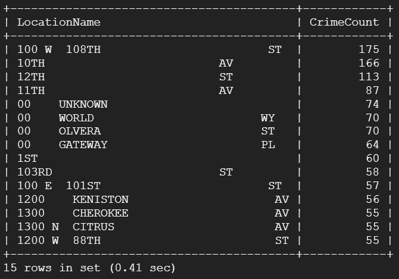
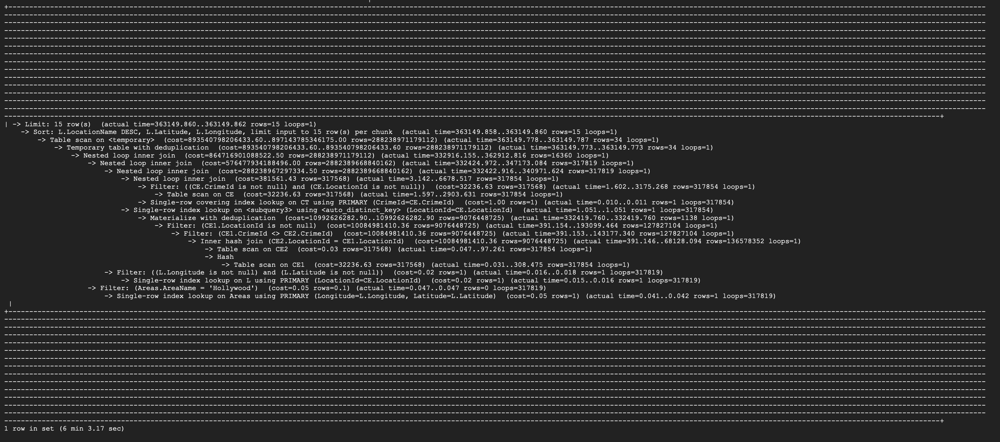
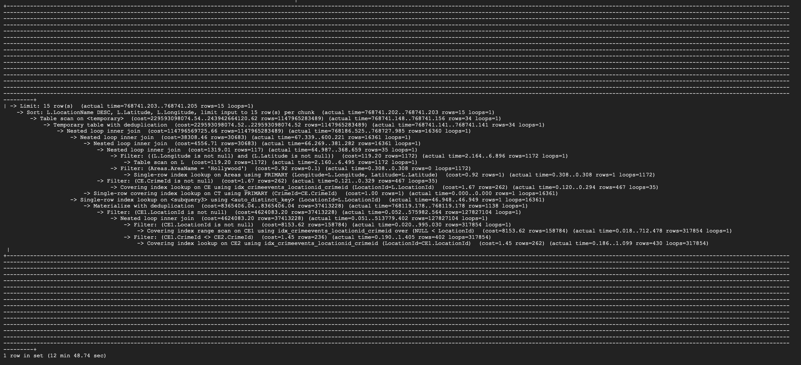

# Stage.3 : Database Implementation and Indexing

## Proof of Building Database on GCP


## DDL Commands

We use the following DDL commands to build up the tables.

```sql
-- USERS TABLE
CREATE TABLE SHT.Users (
    UserId VARCHAR(255) PRIMARY KEY,
    Email VARCHAR(255) UNIQUE,
    Password VARCHAR(255),
    Gender VARCHAR(255) CHECK(Gender IN ('male', 'female', 'other', 'unknown')) DEFAULT 'unknown',
    Age INT DEFAULT -1,
    Role VARCHAR(255) CHECK(Role IN ('user', 'reviewer'))
);

-- CRIME TYPES TABLE
CREATE TABLE SHT.CrimeTypes (
    CrimeId INTEGER PRIMARY KEY,
    CrimeName VARCHAR(255)
);

-- AREAS TABLE
CREATE TABLE SHT.Areas (
		Longitude VARCHAR(255),
    Latitude VARCHAR(255),
    AreaName VARCHAR(255),
    PRIMARY KEY (Longitude, Latitude)
);
-- LOCATION TYPES TABLE
CREATE TABLE SHT.LocationTypes (
    PremisId INT PRIMARY KEY,
    PremisName VARCHAR(255)
);

-- LOCATIONS TABLE
CREATE TABLE SHT.Locations (
    LocationId INTEGER PRIMARY KEY,
    LocationName VARCHAR(255),
    Latitude VARCHAR(255) REFERENCES Areas(Latitude),
    Longitude VARCHAR(255) REFERENCES Areas(Longitude),
    PremisId INT REFERENCES LocationTypes(PremisId)
);

-- CRIME EVENTS TABLE
CREATE TABLE SHT.CrimeEvents (
    EventId INT PRIMARY KEY,
    Date DATETIME,
    Time TIME,
    CrimeId INT REFERENCES CrimeTypes(CrimeId),
    LocationId INT REFERENCES Locations(LocationId)
);

CREATE TABLE SHT.Trends (
    LocationId INT PRIMARY KEY REFERENCES Locations(LocationId),
    Value DOUBLE
);

CREATE TABLE SHT.Favorites (
    UserId VARCHAR(255) REFERENCES Users(UserId),
    LocationId INT REFERENCES Locations(LocationId),
    PRIMARY KEY (UserId, LocationId)
);

CREATE TABLE SHT.Reports (
    LocationId INT REFERENCES Locations(LocationId),
    CrimeId INT REFERENCES CrimeTypes(CrimeId),
    Date DATE,
    Time TIME,
    PRIMARY KEY (LocationId, CrimeId, Date)
);
```

## Table Implementation

For Table `Users`, some random users are inserted into the table.

```sql
INSERT INTO SHT.Users (UserId, Email, Password, Gender, Age, Role)
VALUES ('user001', 'john.doe@openai.com', 'password1', 'male', 30, 'user');
VALUES ('user002', 'jane.doe@openai.com', 'password2', 'female', 28, 'reviewer');
VALUES ('user003', 'alexander.smith@openai.com', 'password3', 'other', 35, 'user');
VALUES ('user004', 'linda.jones@openai.com', 'password4', 'female', 32, 'reviewer');
VALUES ('user005', 'michael.brown@openai.com', 'password5', 'male', 40, 'user');
```


For Table `CrimeTypes`, it is implemented by the following query:

```sql
INSERT INTO SHT.CrimeTypes (CrimeId, CrimeName)
SELECT DISTINCT Crm_Cd, Crm_Cd_Desc
FROM SHT.Original;
```


For Table `Areas`, it is implemented by the following query:

```sql
INSERT INTO SHT.Areas (Longitude, Latitude, AreaName)
SELECT DISTINCT LON, LAT, AREA_NAME
FROM SHT.Original
WHERE LON != 0 AND LAT != 0
ON DUPLICATE KEY UPDATE AreaName = VALUES(AreaName); //Avoid repetition

```


For Table  `LocationTypes`, it is implemented by the following query:

```sql
INSERT INTO SHT.LocationTypes(PremisId, PremisName)
SELECT DISTINCT Premis_Cd, Premis_Desc
FROM SHT.Original;
```


For Table  `LocationTypes`, it is implemented by the following query:

```sql
INSERT INTO SHT.Locations(LocationId, LocationName, Latitude, Longitude, PremisId)
SELECT DISTINCT Rpt_Dist_No, LOCATION, LAT, LON, Premis_Cd
FROM SHT.Original
ON DUPLICATE KEY UPDATE Latitude = VALUES(Latitude), Longitude = VALUES(Longitude);
```


For Table  `CrimeEvents`, it is implemented by the following query:

```sql
INSERT INTO SHT.CrimeEvents(EventId, Date, Time, CrimeId, LocationId)
SELECT DISTINCT DR_NO, DATE_OCC, TIME_OCC, Crm_Cd, Rpt_Dist_No
FROM SHT.Original2;
```


For Table  `Trends`, it is implemented by the following query:

```sql
INSERT INTO SHT.Trends(LocationId, Value)
SELECT Rpt_Dist_No, COUNT(*)
FROM SHT.Original
GROUP BY Rpt_Dist_No;
```


For Table  `Favourites`, some random favourite location data is inserted into the table.

```sql
INSERT INTO SHT.Favorites(UserId, LocationId)
VALUES 
('user001', 101),
('user002', 105),
('user003', 109),
('user004', 111),
('user005', 122);
```


For Table  `Reports`, some random report data is inserted into the table.

```sql
INSERT INTO SHT.Reports(LocationId, CrimeId, Date, Time)
VALUES 
(101, 510, '2023-10-25','00:10:30'),
(105, 440, '2023-10-25','00:12:00'),
(109, 901, '2023-10-25','00:16:30'),
(111, 740, '2023-10-25','00:18:30'),
(122, 354, '2023-10-25','00:21:00');
```


## Advanced SQL Queries

1. Find location names and their latitude and longitude for crimes that have at least two crime types and occurred in the Hollywood area.


1. Find out where the most crimes are committed between 8:00 and 9:00 AM.



## Indexing Analysis

### Advanced Query 1

We first use `Explain Analyze` to find the performance of the original query, the result is as shown:


It has a runtime of 7+ minutes.

**We then apply three indexing methods trying to improve the runtime:**

1. **Index on `Locations` table for `LocationId`**
    
    This index will speed up the JOIN operation between the  `Locations`  and  `CrimeEvents` tables, as it will allow the database to quickly find the corresponding records in the  `Locations`  table based on `LocationId`.
    
    ```sql
    mysql> CREATE INDEX idx_locations_locationid ON Locations (LocationId);
    Query OK, 0 rows affected (0.28 sec)
    Records: 0  Duplicates: 0  Warnings: 0
    ```
    
    
    
    It has a slightly faster runtime of about 6 minutes 3 seconds.
    
2. **Index on `CrimeEvents` table for `LocationId` and `CrimeId`:**
    
    This index will speed up both the JOIN operation and the subquery that checks for different `CrimeId` on the same `LocationId`. The database can use this index to quickly find the corresponding records in the `CrimeEvents` table based on `LocationId` and `CrimeId`.
    
    ```sql
    mysql> CREATE INDEX idx_crimeevents_locationid_crimeid ON CrimeEvents (LocationId, CrimeId);
    Query OK, 0 rows affected (2.31 sec)
    Records: 0  Duplicates: 0  Warnings: 0
    ```
    
    
    
    It’s surprising to see it take longer than the original runtime as it take 12+ minutes, we’ll not use this index design.
    
3. **Index on `Areas` table for `Longitude`, `Latitude`**
    
    This index will speed up the subquery that checks if a location is in the 'Hollywood' area. The database can use this index to quickly find the corresponding records in the `Areas` table based on `Longitude` and `Latitude`.
    
    ```sql
    mysql> CREATE INDEX idx_areas_longitude_latitude ON Areas (Longitude, Latitude);
    Query OK, 0 rows affected (0.83 sec)
    Records: 0  Duplicates: 0  Warnings
    ```
    
    
    
    It has a slightly faster runtime of about 6 minutes 10 seconds.
    
    Based on the experiments conducted with different indexing strategies, it seems that the best approach for optimizing the query is to use the first index design: indexing the `Locations` table for `LocationId`. Here’s a summary and analysis of the indexing experiments conducted:
    
    1. **Index on `Locations` table for `LocationId`:**
        - **Result**: This index slightly improved the query performance, reducing the runtime to about 6 minutes and 3 seconds from the original 7+ minutes.
        - **Analysis**: Since the `Locations` table is joined with the `CrimeEvents` table using the `LocationId`, having an index on `LocationId` in the `Locations` table helps in speeding up this join operation. The database can quickly find the corresponding `LocationId` in the `Locations` table, making the join operation more efficient.
    2. **Index on `CrimeEvents` table for `LocationId` and `CrimeId`:**
        - **Result**: This index surprisingly made the performance worse, with a runtime of 12+ minutes.
        - **Analysis**: An index on `LocationId` and `CrimeId` in the `CrimeEvents` table should have theoretically sped up the subquery and the join operations. However, it seems that the database optimizer did not effectively use this index, or the overhead of maintaining a composite index outweighed the benefits in this specific query.
    3. **Index on `Areas` table for `Longitude`, `Latitude`:**
        - **Result**: The performance was slightly improved, with a runtime of about 6 minutes and 10 seconds.
        - **Analysis**: The index on `Longitude` and `Latitude` in the `Areas` table was supposed to speed up the subquery filtering by area. It seems to have a slight positive effect, but not as much as one might expect. The database can find the specific coordinates faster, but the overall impact on the query performance is limited.
    
    ### Decision and Justification
    
The decision is to use the index on the CrimeEvents table for LocationId and CrimeId. This decision is based on it provides a slight improvement in the query's performance. And it can improve the runtime compared with other two. 
    

### Advanced Query 2

We first use `Explain Analyze` to find the performance of the original query, the result is as shown:


We then apply three indexing methods trying to improve the runtime:

1. **Index on `Locations` table for `LocationId`**
    
    This index will speed up the JOIN operation between the `Locations` and `CrimeEvents` tables, as it will allow the database to quickly find the corresponding records in the `Locations` table based on `LocationId`.
    
    ```sql
    mysql> CREATE INDEX idx_locations_locationid ON Locations (LocationId);
    Query OK, 0 rows affected, 1 warning (0.07 sec)
    Records: 0  Duplicates: 0  Warnings: 1
    ```
    
    
    
    it is a bit faster than original, about 0.05s.
    
2. **Index on `CrimeEvents` table for `Time` :**
    
    This index will speed up checking the time between 00:08:00 and 00:09:00. The database can use this this index to quickly find the corresponding records in the `CrimeEvents`table on `LocationName`.
    
    ```sql
    mysql> CREATE INDEX idx_time ON CrimeEvents (Time);
    Query OK, 0 rows affected (2 min 53.91 sec)
    Records: 0  Duplicates: 0  Warnings: 0
    ```
    
    
    
    This cost more time to search, and it use a lot of time in creating the indexing.
    
3. **Index on `CrimeEvents` table for `LocationId` :**
    
    This index will speed up the JOIN operation between the `Locations` and `CrimeEvents` tables, as it will allow the database to quickly find the corresponding records in the `CrimeEvents` table based on `LocationId`.
    
    ```sql
    CREATE INDEX idx_CrimeEvents_locationid ON CrimeEvents (LocationId);
    Query OK, 0 rows affected (1.90 sec)
    Records: 0  Duplicates: 0  Warnings: 0
    ```
    
   
    
    This cost more time to search using the indexing.
	
 The decision is to use the index on the CrimeEventes table for Time. This decision is based on it will greatly improve the running speed of JOIN operation, and it won’t create index on primary key, so it should be the best choice among three.
    
    ### Decision and Justification
    
    1. **Index on Locations.LocationId:**
    This indexing strategy resulted in a reduction of query time from 400 ms to 353 ms. This acceleration of query speed make sense, as LocationId is the field linking the Locations and CrimeEvents tables. Since Locations.LocationId is the primary key, MySQL can efficiently utilize this index to quickly find matching records in the CrimeEvents table.
    2. **Index on CrimeEvents.Time:**
    It did not enhance query performance; instead, it led to an increase in query time to 476 milliseconds. This could be because the selectivity of the time field is not high, or the MySQL optimizer determined that using this index was less effective than a full table scan, especially for queries with very short time ranges, like within a minute.
    3. **Index on CrimeEvents.LocationId:**
    The intent of creating this index was to improve the efficiency of join queries, but in reality, the query time slightly increased to 456 milliseconds. This may be because the optimizer was already making good use of the primary key index of the Locations table. Moreover, if the index was removed before and the performance is still slow, it could be due to factors such as data distribution, invalidation of query caches, or the overhead of maintaining the index.
